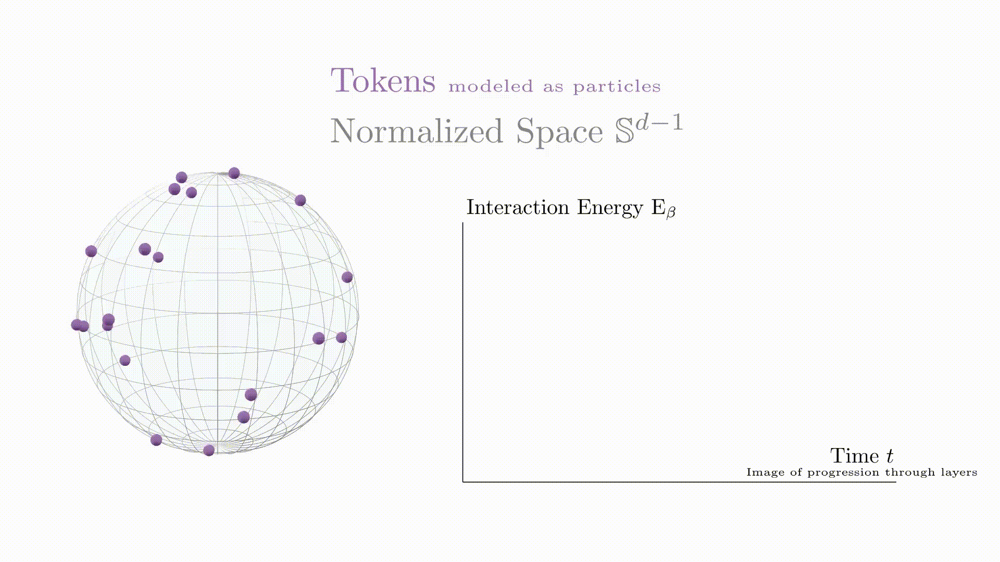

# Particle Dynamics Simulation and Animation

This project implements the modelization made in [A mathematical perspective on Transformers (2023)](https://arxiv.org/abs/2312.10794) paper. In this paper, authors propose a new mathematical model for transformers, based on the dynamics of particles. This repository contains the code to generate the following animation to illustrate the findings.



## Project Structure

- `simulation.py`: Contains the code to simulate the particle dynamics and compute the trajectory and energy of the system.
- `animation.py`: Contains the code to animate the particle movement on a sphere and the evolution of interaction energy using Manim.
- `trajectory_full.npy`: Numpy file storing the computed trajectory of particles.
- `energy_full.npy`: Numpy file storing the computed interaction energy over time.
- `simulation_params.txt`: Text file storing the simulation parameters.
- `energy_evolution.png`: Plot of the energy evolution over time.

## Requirements

- Python 3.x
- Numpy
- Matplotlib
- Manim


## Running the Simulation

To run the simulation and generate the trajectory and energy data, execute:
```sh
python simulation.py
```

This will create ``trajectory_full.npy``, ``energy_full.npy``, and ``energy_evolution.png`` files in the project directory.

## Running the Animation

To visualize the particle movement and energy evolution, execute:

```sh
manim -pql animation.py FullModelScene
manim -pql animation.py EnergyGraphScene
```

This will generate and display the animations for the particle dynamics and energy evolution.

## Simulation Parameters
The simulation parameters can be adjusted in ``simulation.py``:

- ``n``: Number of particles
- ``d``: Dimensions (for $\mathbb{S}^2$, use d=3)

- ``beta``: Inverse temperature
- ``dt``: Time step
- ``steps``: Number of integration steps
